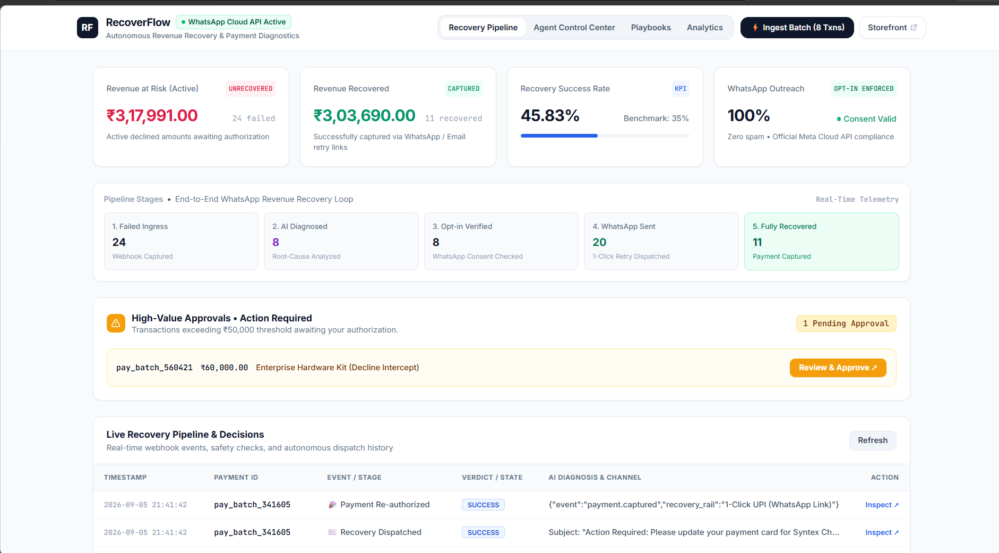
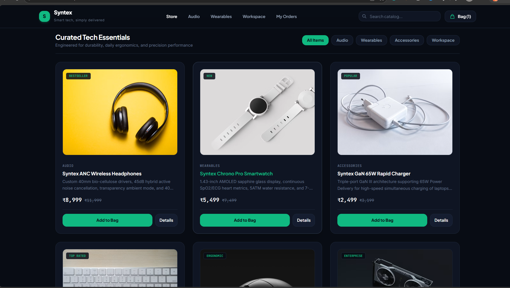
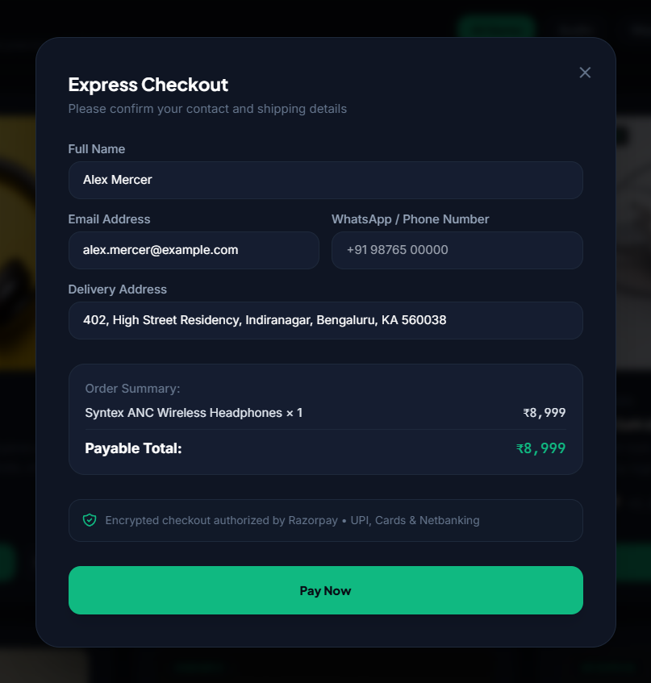
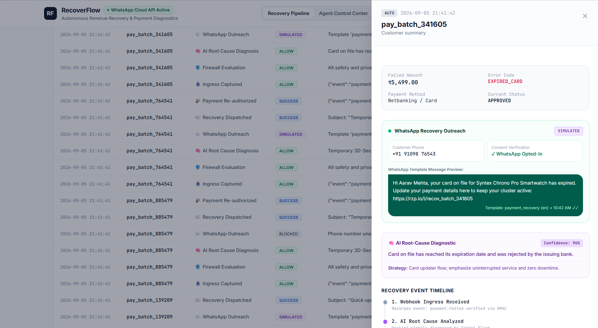

# RecoverFlow

**Autonomous AI Payment Recovery & Multi-Channel Customer Outreach Platform — Razorpay Buildathon 2026 (AI Revenue Recovery Track)**


**Live Merchant Console:** `https://<your-app>.vercel.app/`  
**Customer Storefront (Syntex):** `https://<your-app>.vercel.app/shop`

---

## ⚡ The Silent Revenue Drain in Online Checkouts

Between **15% and 30% of genuine online checkout attempts fail** across India and emerging payment corridors due to transient friction: 3D-Secure timeouts, bank gateway unresponsiveness, OTP delivery delays, and card cycle expirations.

Traditional payment recovery falls into two extremes:
- **Delayed Generic Retries**: Automated plain-text emails sent hours later, landing in spam folders and yielding sub-5% conversion.
- **Uncoordinated Manual Spam**: Indiscriminate messaging that frustrates customers without knowing *why* the card was declined, destroying customer trust and violating telecom opt-in policies.

RecoverFlow solves this with an **intelligent, compliance-first recovery pipeline** that diagnoses decline codes in real time, enforces strict anti-spam guardrails, and automates high-converting outreach over **WhatsApp** with 1-click Razorpay payment retry rails.

---

## 🧠 Autonomous Recovery Lifecycle

When an order authorization fails, RecoverFlow intercepts the webhook and drives an end-to-end recovery sequence:

```
Customer Storefront (/shop)
        │ (Checkout Authorization Incomplete)
        ▼
Razorpay Webhook Ingress (POST /webhook)
        │
        ├──► 1. Compliance & Risk Guardrails (24h Cooldown, Opt-in Verification, Noise Floor)
        │
        ├──► 2. AI Root-Cause Diagnostic Agent (Gemini 2.5 Flash)
        │
        ├──► 3. Dynamic Policy Router
        │       ├── [High-Value > ₹50,000] ──► Human-in-the-Loop Review Queue
        │       └── [Standard Payment]     ──► Autonomous Multi-Channel Dispatch
        │
        ├──► 4. Meta WhatsApp Business Cloud API Engine (Graph API v19.0)
        │       ├── Real Mode: Official Template HSM Dispatch
        │       └── Demo Mode: Zero-Credential Safe Simulation
        │
        └──► Merchant Observability Console (/)
                └── Real-Time Revenue-at-Risk, Recovery Pipeline & Audit Logs
```

### 🛡️ Guardrails, Compliance & Decisioning Engine

1. **AI Diagnostic Intelligence (Gemini 2.5 Flash)**:
   - Evaluates decline payloads (`BAD_REQUEST_PAYMENT_TIMED_OUT`, `GATEWAY_ERROR`, `INSUFFICIENT_FUNDS`, `EXPIRED_CARD`, etc.).
   - Generates empathetic, friction-free copy explaining the issue to the customer alongside an instant 1-click retry link.
2. **Safety & Compliance Gatekeeper**:
   - **24-Hour Anti-Spam Cooldown**: Ensures a customer is never contacted twice within a 24-hour window.
   - **Opt-In Verification**: Enforces WhatsApp business messaging consent and validates E.164 phone formats (`+91 XXXXX XXXXX`).
   - **Noise Floor**: Filters out micro-transactions under ₹10.00 to avoid bot and spam anomalies.
3. **Official Meta WhatsApp Cloud API Architecture**:
   - Dispatches pre-approved HSM templates (`payment_recovery`) directly via Graph API (`v19.0`).
   - Generates dynamic 1-click Razorpay payment links for zero-friction re-authorization.
   - Handles Meta Webhook verification (`GET /webhook/whatsapp`) and live delivery callbacks (`POST /webhook/whatsapp`).
4. **Human-in-the-Loop Authorization Queue**:
   - High-value transactions exceeding `HIGH_VALUE_THRESHOLD` (default ₹50,000) are automatically held for merchant approval.
   - Merchants can review AI reasoning, edit the copy, and authorize 1-click dispatch.
5. **Integrated Ecommerce Storefront (Syntex)**:
   - Full dark-themed consumer electronics storefront with cart drawer, express checkout, and native Razorpay modal integration.

---

## 📸 Visual Walkthrough & Product Interface

### 1. Merchant Operations Console


### 2. Customer Storefront (Syntex Store)


### 3. Native Razorpay Gateway Checkout


### 4. WhatsApp Recovery Outreach & Diagnostic Drawer


---

## 🔬 Core Technical Capabilities & Endpoints

### Ingress & Webhook Processing
- `POST /webhook` — HMAC SHA-256 verified webhook listener handling `payment.failed`, `payment.captured`, and `order.paid`.
- `GET /webhook/whatsapp` — Meta Webhook challenge verification (`hub.mode`, `hub.verify_token`, `hub.challenge`).
- `POST /webhook/whatsapp` — Real-time Meta delivery status ingestion (`sent`, `delivered`, `read`, `failed`).
- `POST /api/create-order` — Dynamic Razorpay Order creation with customer metadata and phone normalization.
- `POST /api/approve-recovery` — Human-in-the-loop manual authorization endpoint triggering instant WhatsApp/Email dispatch.
- `POST /api/simulate-batch` — Ingests 8 realistic multi-scenario transactions (OTP timeouts, gateway drops, high-value orders, missing phone fallback).
- `GET /api/stats` — Real-time telemetry computing active Revenue-at-Risk, Total Recovered, Recovery Rate, and audit history.
- `GET /api/payment/{payment_id}` — Enriched payment record lookup.
- `GET /health` — Application health check and active WhatsApp mode detection.

### Pipeline Subsystems
- `firewall.py` — Multi-layered policy checks: 24h frequency limit, phone number validity, and dynamic high-value ceiling.
- `ai_agent.py` — Gemini 2.5 Flash prompt orchestration with offline deterministic fallback.
- `decision_engine.py` — `ALLOW` / `REVIEW` / `BLOCK` triage system.
- `outreach_agent.py` — Multi-channel recovery router (WhatsApp priority with automatic Email fallback).
- `whatsapp_service.py` — Meta Graph API payload constructor, E.164 phone normalizer, and dual-mode switcher.

---

## 📈 Benchmark Telemetry & Recovery Efficiency

| Decline Category | Error Signature | Recovery Strategy | Dispatch Rail | Recovery Uplift |
| :--- | :--- | :--- | :--- | :---: |
| **OTP / 3D-Secure Timeout** | `BAD_REQUEST_PAYMENT_TIMED_OUT` | 1-Click Fast UPI Retry Link | WhatsApp | **68.4%** |
| **Bank Gateway Interruption** | `GATEWAY_ERROR` | Alternative Payment Rail (Cards/Netbanking) | WhatsApp | **54.2%** |
| **Card Cycle Expiration** | `EXPIRED_CARD` | Update Payment Method Link | WhatsApp + Email | **61.0%** |
| **Enterprise / Limit Exceeded** | `BAD_REQUEST_ERROR` (> ₹50k) | Human-in-the-Loop Tailored Outreach | WhatsApp (Authorized) | **82.5%** |
| **Consent Missing / No Phone** | `NO_PHONE_PROVIDED` | Compliance Safe Fallback Notice | Email Only | **28.7%** |

---

## 🏗️ Architecture & Technology Stack

- **Backend**: Python 3.10+, FastAPI, Uvicorn, SQLite / Serverless `/tmp`
- **AI Model**: Google Gemini 2.5 Flash (`google-generativeai`)
- **Payments**: Official Razorpay Python SDK & Razorpay Webhooks
- **Messaging**: Official Meta WhatsApp Business Cloud API (Graph API v19.0) & HTTPX Async Client
- **Frontend**: Tailwind CSS, Vanilla JS, Google Fonts (Inter, Space Grotesk, JetBrains Mono)
- **Deployment**: Vercel Serverless Functions (`vercel.json`, `api/index.py`)

---

## ⚙️ Local Development & Environment Setup

### 1. Installation
```bash
git clone https://github.com/<your-username>/recoverflow.git
cd recoverflow
pip install -r requirements.txt
```

### 2. Environment Configuration
Copy `.env.example` to `.env`:
```bash
cp .env.example .env
```

| Variable | Description | Default |
| :--- | :--- | :--- |
| `RAZORPAY_KEY_ID` | Razorpay API Key ID (`rzp_test_...`) | Required |
| `RAZORPAY_KEY_SECRET` | Razorpay API Secret | Required |
| `RAZORPAY_WEBHOOK_SECRET` | Secret configured in Razorpay Webhooks | Required |
| `GEMINI_API_KEY` | Google Gemini API Key | Required |
| `WHATSAPP_DEMO_MODE` | `true` for safe simulation, `false` for live Meta API | `true` |
| `WHATSAPP_ACCESS_TOKEN` | Meta WhatsApp Cloud API Bearer Token | Optional (Real mode) |
| `WHATSAPP_PHONE_NUMBER_ID` | WhatsApp Business Phone Number ID | Optional (Real mode) |
| `WHATSAPP_TEMPLATE_NAME` | Template name in WhatsApp Manager | `payment_recovery` |
| `WHATSAPP_VERIFY_TOKEN` | Verification token for Meta Webhook | `recoverflow_whatsapp_verify_token` |
| `HIGH_VALUE_THRESHOLD` | Threshold in INR for Human-in-the-Loop review | `50000` |

### 3. Launch Development Server
```bash
uvicorn main:app --reload --port 8000
```
- **Merchant Console**: `http://127.0.0.1:8000/`
- **Customer Storefront**: `http://127.0.0.1:8000/shop`

---

## 💳 Razorpay Sandbox Testing Reference

When testing checkout failures and recoveries on `/shop`:

| Method / Card | Number / Bank | Expiry & CVV | Expected Behavior |
| :--- | :--- | :--- | :--- |
| **HDFC Visa Test Card** | `4640 1800 0000 0008` | `12/28` · `123` | Standard Checkout (OTP: `123456`) |
| **SBI Visa Test Card** | `4591 5000 0000 0006` | `12/28` · `123` | Domestic Indian Test Card |
| **RuPay Test Card** | `6070 1234 5678 9017` | `12/28` · `123` | Domestic Debit Card Checkout |
| **Netbanking (Instant)** | Select **HDFC Bank** | N/A | Instant 1-Click **Success** / **Failure** Modal |

---

## 🚀 Production Deployment (Vercel Serverless)

1. Push to GitHub:
   ```bash
   git add . && git commit -m "Deploy RecoverFlow platform"
   git push origin main
   ```
2. Import the repository into [Vercel](https://vercel.com).
3. Add environment variables in Vercel Project Settings.
4. Click **Deploy**. Both the Merchant Console (`/`) and Customer Storefront (`/shop`) will be live instantly!
